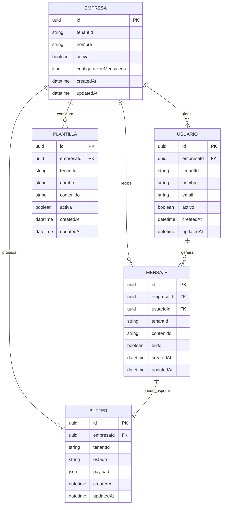

# Arquitectura del proyecto

## Visión general
Abiel Core es una plataforma SaaS de automatización y gestión de mensajería de WhatsApp basada en una arquitectura de monorepo con un monolito modular en el backend y paneles separados para administración y clientes.

El repositorio está compuesto por:
- backend: API principal desarrollada en TypeScript con Fastify, Prisma ORM y PostgreSQL.
- web-admin: panel de control global para el Super Admin.
- web-customer: panel de gestión para empresas clientes y agentes.
- shared: tipos de TypeScript, interfaces y validadores Zod compartidos entre los servicios.

### Estructura oficial del monorepo
```text
abiel-core/
├── .github/
│   └── roles/
│       ├── po-architect.md
│       ├── architect.md
│       ├── database.md
│       ├── engineer.md
│       ├── qa.md
│       ├── security.md
│       └── devops.md
├── ARCHITECTURE.md
├── DECISIONS.md
├── FEEDBACK.md
├── package.json
├── tsconfig.json
├── backend/
│   ├── .env
│   ├── prisma/
│   │   └── schema.prisma
│   ├── src/
│   │   ├── app.ts
│   │   ├── server.ts
│   │   └── modules/
│   │       ├── webhook/
│   │       ├── tenant/
│   │       ├── buffer/
│   │       ├── orchestrator/
│   │       └── auth/
│   └── package.json
├── web-admin/
│   └── src/app/
├── web-customer/
│   └── src/app/
└── shared/
    ├── src/types/
    └── src/validators/
```

### Puertos del entorno
- API: puerto 5000.
- Web admin: puerto 5001.
- Web customer: puerto 5002.
- Todas las aplicaciones deben ejecutarse en el entorno con estos puertos asignados y consumir la información desde ahí.

## Principios de diseño
- Aislamiento multi-tenant obligatorio: toda consulta a base de datos en Prisma debe incluir estrictamente el filtro de tenantId o la relación corporativa correspondiente. No se permiten consultas globales sin contexto de empresa.
- Separación de responsabilidades entre ingestión, validación, orquestación, IA y respuesta.
- Simplicidad por encima de sobreingeniería.
- Seguridad y trazabilidad como requisitos no negociables.
- Contratos compartidos: cualquier estructura de datos que se comunique entre backend y frontends debe estar tipada y validada mediante shared.
- Identificadores universales: todos los identificadores de dominio y de persistencia deben usar UUID para evitar dependencias de secuencias y mejorar la interoperabilidad entre servicios.
- Disciplina operativa: cada decisión debe ser coherente, documentada y verificable.
- La lógica de negocio debe organizarse en módulos claros: webhook, tenant guard, buffer, orchestrator, response y audit.
- La validación de tenant y empresa debe implementarse como un flujo explícito de negocio, no como comprobaciones dispersas.
- El backend debe exponer un endpoint de webhook real con contrato de entrada/salida, validación y trazabilidad de eventos.

## Modelo operativo del equipo
- Cada conversación debe iniciar con contexto, rol y objetivo claro.
- Cada cambio debe ser ejecutado con orden, criterio y alineación con la arquitectura vigente.
- Cada entrega debe ser trazable a una decisión, un requisito o una observación anterior.
- La coordinación entre roles debe ser fluida, sin solapamientos ni desviaciones.
- Los handoffs deben ser formales, breves y ejecutables para evitar pérdida de contexto.
- Tras cada charla, el secretario debe leer todos los roles, las instrucciones globales, la arquitectura, las decisiones y el feedback, y preparar un pront por rol cuando sea necesario.
- El usuario interactúa con el secretario en lenguaje natural; el secretario traduce esa solicitud al resto del equipo mediante pronts claros y operativos.

## Flujo de negocio
1. Recepción: la API recibe la petición POST cruda desde la pasarela de WhatsApp.
2. Limpieza de datos: se extraen únicamente los campos indispensables (remitente phone, texto message e identificador tenantKey) y se descarta el resto.
3. Buffer temporal: se aplica un mecanismo de espera configurable para acumular mensajes consecutivos y evitar saturación.
4. Tenant Guard: se valida que la empresa exista, esté activa y habilitada; si no, se rechaza la solicitud de inmediato.
5. Orquestación y agentes: una vez superado el filtro de empresa activa, el mensaje se deriva al flujo o agente correspondiente para procesamiento con IA y posterior respuesta.

## Reglas de mantenimiento
- Cada chat debe leer esta arquitectura antes de actuar.
- Los cambios estructurales deben actualizar este documento.
- Los roles operativos deben consultarlo como fuente de verdad técnica.
- La ejecución debe ser precisa, consistente y alineada con la visión del equipo.
- El backend debe registrar el plugin de CORS permitiendo de forma explícita los orígenes de web-admin en el puerto 5001 y web-customer en el puerto 5002.

## Arquitectura propuesta para Abiel Core Backend

### Objetivo
- Definir un backend modular dentro del monorepo, orientado a recibir mensajes entrantes de WhatsApp, validar empresas activas y orquestar respuestas con trazabilidad, seguridad y aislamiento de tenants.

### Estructura lógica del backend
- Ingestión: recibir webhooks o eventos entrantes, normalizar el payload y validar el esquema mínimo.
- Contexto de tenant: resolver de forma obligatoria el tenantId, customerId, conversationId y el contexto de autenticación asociado.
- Tenant Guard: validar de forma explícita que el tenant exista, que la empresa asociada esté activa y que el flujo tenga permisos suficientes para continuar.
- Buffer: desacoplar la ingestión del procesamiento cuando sea necesario y conservar el contexto del evento.
- Orquestación: coordinar un flujo lineal de procesamiento que vaya de ingestión a decisión, respuesta y auditoría.
- Respuesta: preparar y publicar la salida del flujo hacia el canal correspondiente.
- Auditoría y observabilidad: registrar eventos, decisiones y errores sin depender de estado compartido entre tenants.

### Modelo de multitenancy
- Todo flujo debe mantener un tenantId explícito en cada punto crítico: ingreso, almacenamiento, autorización, ejecución y auditoría.
- Los servicios deben operar con un contexto de tenant aislado y no asumir estado global ni compartido entre clientes.
- La base de datos debe modelar el aislamiento mediante tenantId en registros y consultas críticas, con índices y reglas de acceso que impidan cruzar datos entre tenants.
- Todas las entidades persistentes deben usar UUID como identificador primario y no depender de enteros secuenciales.
- Las colas, topics o eventos de salida deben incluir el tenantId en metadatos o particiones para evitar mezclas o fugas entre tenants.
- No se debe permitir lógica de negocio que dependa de variables globales o de cachés compartidas sin un scope de tenant explícito.

### Contratos mínimos compartidos

#### Contrato de entrada del webhook
Campos obligatorios:
- tenantId: identificador del tenant que originó el evento.
- provider: origen del evento, por ejemplo WhatsApp.
- eventId: identificador único del evento recibido.
- timestamp: marca de tiempo de ingreso en formato estándar ISO 8601.
- customerId: identificador del cliente o empresa asociada al flujo.
- conversationId: identificador de la conversación para correlación.
- message: objeto mínimo con el contenido del mensaje entrante, por ejemplo text o content.
- channel: metadatos mínimos del canal, por ejemplo provider, from, to.

Campos opcionales:
- metadata: información adicional no crítica para el flujo.
- replyToId: referencia a un mensaje previo si aplica.
- attachments: datos adjuntos si el canal los soporta.

Regla de diseño:
- El payload debe normalizarse antes de cualquier procesamiento y no debe depender de datos crudos del cliente sin validación previa.
- Todo webhook debe recibir un contrato formal de entrada definido en shared y validado antes de entrar al flujo.

#### Contrato de contexto de validación
- tenantId: identificador del tenant en contexto.
- companyId: empresa asociada al tenant.
- companyStatus: estado de activación de la empresa.
- permissions: permisos o capacidades mínimas requeridas para ejecutar el flujo.
- traceId: identificador de trazabilidad del proceso.

Regla de diseño:
- La validación de empresa activa debe producir un resultado explícito: accepted, rejected o pending, con motivo de rechazo si aplica.
- El resultado de validación debe conservarse en un objeto estructurado para trazabilidad y auditoría.

#### Contrato de salida de orquestación
- tenantId: tenant asociado al flujo.
- conversationId: conversación afectada.
- eventId: evento origen.
- status: estado del procesamiento, por ejemplo queued, processed, failed.
- decision: resultado de la orquestación o acción recomendada.
- response: respuesta preparada para publicar, si aplica.
- traceId: identificador para auditoría y seguimiento.

Regla de diseño:
- Toda salida de orquestación debe incluir trazabilidad suficiente para auditar el flujo sin necesidad de inspeccionar estado global.
- El endpoint de webhook debe devolver una respuesta normalizada con status, traceId y decisión.

### Validación de empresa activa y flujo de orquestación
- El flujo debe validar la empresa activa y los permisos del tenant antes de ejecutar cualquier acción de negocio o de publicar una respuesta.
- Si la empresa no está activa o el contexto no es válido, el sistema debe rechazar el evento, registrar la razón y no avanzar en el flujo.
- La orquestación debe ser lineal y predecible: ingestión → validación → decisión → respuesta → auditoría.
- El diseño debe priorizar procesos claros, sin bifurcaciones innecesarias ni dependencias ocultas entre capas.
- La validación de tenant y empresa debe quedar encapsulada en un módulo explícito de negocio y no mezclada con la lógica del endpoint HTTP.

### Uso de shared para contratos y validadores
- El módulo shared debe contener los contratos compartidos del backend, los tipos de entrada/salida y los validadores del contexto de tenant, webhook y empresa activa.
- El backend debe consumir esos contratos para evitar duplicación de reglas y mantener consistencia entre módulos del monorepo.
- La lógica de validación debe residir en el módulo compartido o en servicios claramente definidos, pero nunca dispersa entre capas sin trazabilidad.
- Los contratos deben incluir respuesta estructurada para el webhook, con estado, traceId, decisión y motivo de rechazo cuando aplique.

### Propuesta de estructura para shared
- Crear un conjunto de tipos base para los contratos del flujo de mensajería: webhook input, validation context, orchestration output y common metadata.
- Definir validadores para garantizar que los campos obligatorios existan, que el tenantId sea presente, que el timestamp sea válido y que la empresa activa pueda ser evaluada sin ambigüedad.
- Mantener la separación entre tipos de dominio y tipos de transporte para evitar mezclar representación de datos con reglas de negocio.
- Incorporar un módulo de UUID en shared para centralizar generación, normalización y validación de identificadores universales.
- Asegurar que los tipos compartidos puedan usarse tanto por backend como por los paneles del monorepo cuando se requiera interoperabilidad de datos.

### Modelo de datos inicial para la API de mensajería
- Empresa: representa la organización cliente y su configuración base para el uso de mensajería.
- Usuario: representa al agente o usuario que interactúa dentro de la empresa.
- Mensaje: almacena mensajes entrantes o salientes del flujo de WhatsApp.
- Buffer: acumula mensajes o eventos temporales antes de la orquestación.
- Plantilla: contiene las plantillas de respuesta configuradas por empresa para la integración de WhatsApp.

#### Relación propuesta
- Una Empresa puede tener muchos Usuarios, muchos Mensajes y muchas Plantillas.
- Un Usuario puede tener muchos Mensajes.
- Un Buffer pertenece a una Empresa y se asocia a un Mensaje o a un flujo de procesamiento.
- Una Plantilla pertenece a una Empresa y puede ser referenciada por el flujo de respuesta.

#### Diagrama inicial


#### Reglas de diseño para esta propuesta
- Todas las tablas deben usar UUID como identificador primario.
- El campo `tenantId` debe estar presente en todas las tablas críticas.
- La configuración de la API de mensajería para WhatsApp debe residir en la tabla Empresa como un bloque estructurado de configuración, por ejemplo `configuracionMensajeria`.
- La tabla Plantilla debe permitir almacenar mensajes predefinidos para enviar respuestas por WhatsApp.
- El Buffer debe permitir desacoplar la ingestión del procesamiento y conservar el contexto del evento mientras se orquesta.

## Mecanismos de mejora continua
- Cada entrega debe cerrar con una verificación simple: ¿se cumplió el objetivo, se respetó el alcance y se dejó trazabilidad?
- Los bloqueos, riesgos y desviaciones deben registrarse en FEEDBACK.md para no perder aprendizajes.
- Cada rol debe tener un criterio de aceptación claro y medible.
- El secretario debe revisar periódicamente si el flujo sigue siendo claro, ágil y suficientemente disciplinado.
- La validación de calidad se realizará localmente con herramientas de código abierto, sin depender de servicios externos ni de GitHub Actions pagados.
- La estrategia de pruebas debe priorizar ejecución local, cobertura básica y verificación manual de los flujos críticos del backend.
